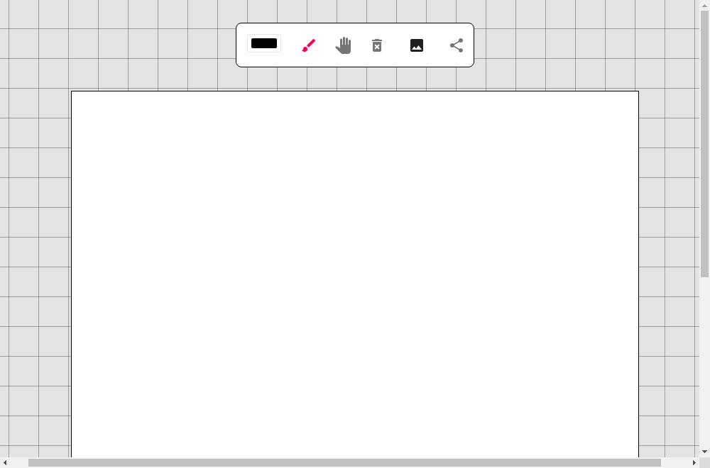

[![LinkedIn][linkedin-shield]][linkedin-url]


<!-- PROJECT LOGO -->
<br />
<p align="center">

 <h1 align="center">Drawnit</h3>

[  ](https://drawnit.herokuapp.com)

  <p align="center">
    Upload an image and draw on it or a blank canvas together with others in real time!
    <br />
    <br />
    <a href="https://drawnit.herokuapp.com">View Demo</a>
  </p>

- [Getting Started](#getting-started)
  - [Prerequisites](#prerequisites)
  - [Installation](#installation)
- [Developing](#developing)
- [Testing](#testing)
  - [Jest Unit Tests](#jest-unit-tests)
  - [Cypress end to end Integration Tests](#cypress-end-to-end-integration-tests)
  - [Cypress Component Tests](#cypress-component-tests)
  - [Commit Hooks / Lint-Staged](#commit-hooks--lint-staged)
- [Built With](#built-with)
- [Contact](#contact)

## Getting Started

This project contains a `/server` and `/client` applications contained in a top-level parent package. In production the backend server serves the static client build files.

The project is organized so that the client and server can be developed as seperate apps. This top level package can be used to build the project into a Node.js application that serves the compiled frontend.

### Prerequisites

- node 16

### Installation

1. Clone the repo
   ```bash
   git clone https://github.com/quaidbartolomei/drawnit.git
   ```
2. Install NPM packages (Project, Client, Server)
   ```bash
   npm run full-install
   ```
3. (Production only): set the env values
   ```env
   MONGO_DB_URI=<your uri here>
   ```

## Developing

- After installation you can start the app in development mode. [mongodb-memory-server](https://github.com/nodkz/mongodb-memory-server) is used to create a temporary db in memory.

Start the server in dev mode:

```bash
npm run server:dev
```

Start the client in dev mode:

```bash
npm run server:dev
```

or use [start-server-and-test](https://github.com/bahmutov/start-server-and-test) to run the server and client in dev mode with a single terminal.

```bash
npm run dev
```

## Testing

### Jest Unit Tests

Jest unit tests for both the client and server are configured to run automatically with lint-staged.

### Cypress end to end Integration Tests

These tests are performed against a running full stack application. Use the following helper script in the top level package to run the client and dev server and run `cypress open` all in the same terminal window.

```bash
npm run cypress
```

### Cypress Component Tests

JSX component based unit testing.

From the `/client` directory run the following script to start the test browser.

```bash
npm run cyc
```

### Commit Hooks / Lint-Staged

Lint staged will perform linting, formatting, package.json sorting, and unit testing as necessary before any files that are committed. File and script settings for lint-staged can be found in `linstagedrc.js`.

- `package.json` - sort with [sort-package-json](https://github.com/keithamus/sort-package-json)
- typescript files - lint and unit test
- all recognized files - format with prettier

## Built With

- [React](https://reactjs.org/)
- [Express](https://expressjs.com/)
- [MongoDB](https://www.mongodb.com/)
- [Socket.IO](https://socket.io/)
- [Typescript](https://www.typescriptlang.org/)
- [Material-UI](https://material-ui.com/)

## Contact

[![LinkedIn][linkedin-shield]][linkedin-url]
[ Quaid Bartolomei ](https://www.linkedin.com/in/quaidb/)

Project Link: [https://github.com/QuaidBartolomei/drawnit](https://github.com/QuaidBartolomei/drawnit)

[linkedin-shield]: https://img.shields.io/badge/-LinkedIn-black.svg?style=for-the-badge&logo=linkedin&colorB=555
[linkedin-url]: https://www.linkedin.com/in/quaidb/
[product-screenshot]: images/screenshot.png
